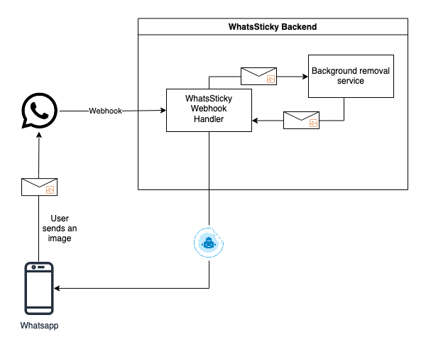

<!-- PROJECT LOGO -->
 

  

  <h3 align="center">WhatASticky (WhatsSticky)</h3>

  

    Whats Sticky is a bot that converts your picture to a Whatsapp sticker and sends it on the chat. It's really easy to use: just send a picture and get your sticker right back.
  

 

## About The Project
When you're tired of sending the same old text-based messages, share your most important moments with friends and family in a whole new way. WhatsSticky is a bot that converts any photo you send it into a sticker that can be shared on WhatsApp. WhatsSticky has a simple and intuitive interface. Just select an image from your phone, send it to the Bot and voila! You have an awesome whatsapp sticker ready to share with your friends.

The following graphic depicts the general architecture of the project. 

## Tech

* [GoLang](https://go.dev/)
* [Echo](https://echo.labstack.com/)
* [Whatsapp cloud API](https://developers.facebook.com/docs/whatsapp/cloud-api/)
* [Python](https://www.python.org/)
* [U-2-Net](https://github.com/xuebinqin/U-2-Net)
* [FFmpeg](https://ffmpeg.org/)

## Roadmap

- [x] Image to Sticker
- [x] Image to Sticker (Remove background)
- [x] Video to animated sticker
- [ ] Handle larger videos
- [ ] Integrate Database to save user information for easier access
- [ ] Make the bot interactive
  - [ ] Have conversation
  - [ ] Ask questions before sending stickers
- [ ] Text over stickers
- [ ] Implement a queue to handle messages

See the [open issues](https://github.com/colt005/whats_sticky/issues) for a full list of proposed features (and known issues).

## Contributing

Contributions are what make the open source community such an amazing place to learn, inspire, and create. Any contributions you make are **greatly appreciated**.

If you have a suggestion that would make this better, please fork the repo and create a pull request. You can also simply open an issue with the tag "enhancement".
Don't forget to give the project a star! Thanks again!

1. Fork the Project
2. Create your Feature Branch (`git checkout -b feature/AmazingFeature`)
3. Commit your Changes (`git commit -m 'Add some AmazingFeature'`)
4. Push to the Branch (`git push origin feature/AmazingFeature`)
5. Open a Pull Request

## Contact

[![LinkedIn][linkedin-shield]][linkedin-url] 
rohan.prabhu05@gmail.com

[linkedin-shield]: https://img.shields.io/badge/-LinkedIn-black.svg?style=for-the-badge&logo=linkedin&colorB=555
[linkedin-url]: https://www.linkedin.com/in/rohan-prabhu05/

